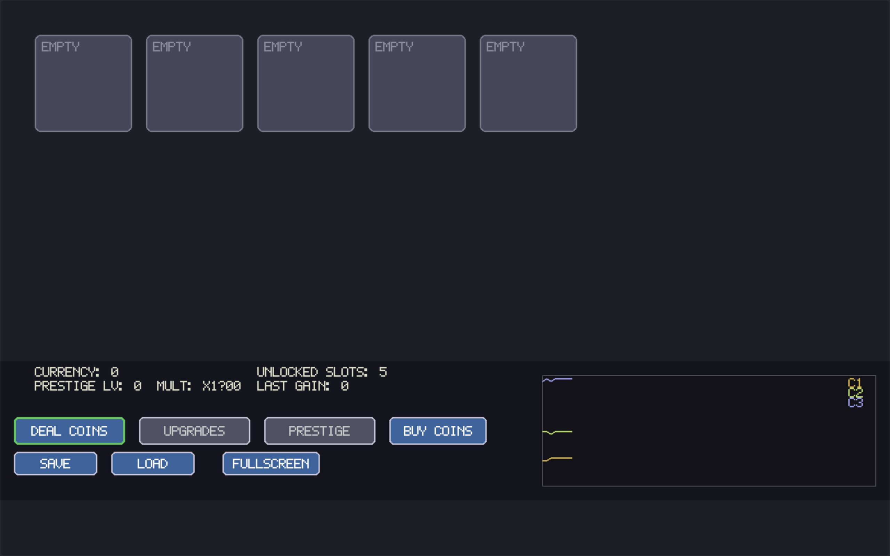

# Combine Them! (Pygame)



Combine Them! is a small, single-file prototype of a "merge" incremental game built with Pygame.

Merge coins to create higher-value coins, sell them to influence a simple market, unlock additional slots, and prestige for permanent bonuses.

This repo is intentionally lightweight and easy to tweak — the game's logic and UI live in `game.py` so you can iterate quickly.

## Badges

- Python 3.8+
- Pygame 2.x

## Quick start

1. (Optional) Create and activate a virtual environment:

```bash
python3 -m venv venv
source venv/bin/activate
```

2. Install dependencies:

```bash
pip install -r requirements.txt
```

3. Run the game from the project root:

```bash
python3 game.py
```

## Core features

- Drag-and-drop coin placement and merging.
- "Deal" spawns coins (one per unlocked slot).
- Buy specific coin levels and unlock extra slots via the Upgrades menu.
- Sell coins to earn currency — sales affect a simple market price model and chart.
- Prestige resets progress for a permanent multiplier.
- Save/load game state to `save.json`.

## Controls

- Click `Deal Coins` to spawn coins.
- Click `Buy Coins` → choose a `Buy C#` option to purchase a coin at that level.
- Click `Upgrades` → `Buy Slot` to expand your board (and other upgrades).
- Shift+click a slot to open the Sell popup (sell 1 / 5 / all).
- Drag a coin from a slot to another to add or merge.
- Use `Save` / `Load` buttons to persist progress.

## Developer notes

- Main code: `game.py` (single-file prototype).
- Save file: `save.json` (created in the working directory).
- Dependencies are listed in `requirements.txt` (Pygame 2.x).
- The game tries `pygame.font` or `pygame.freetype` and falls back to a tiny 5x7 bitmap renderer if needed.
- The bitmap glyphs are defined in `BITMAP_FONT` inside `game.py` — edit that table if you need more fallback characters.

## Recommended edits

- Tweak constants near the top of `game.py` (cooldowns, costs, slot caps) to experiment with balance.

## Contributing

This is a small prototype — open an issue or submit a PR with improvements. Useful contributions include UI polish, balancing changes, or packaging.

## License

This project is provided under the MIT License.

---
